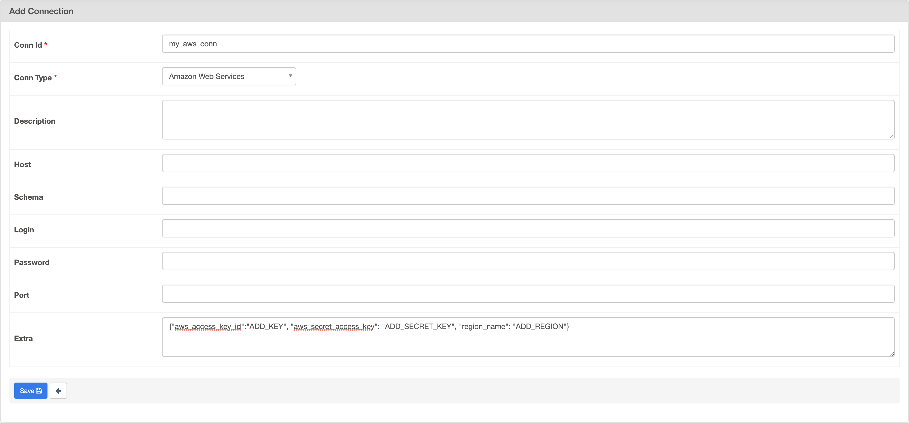
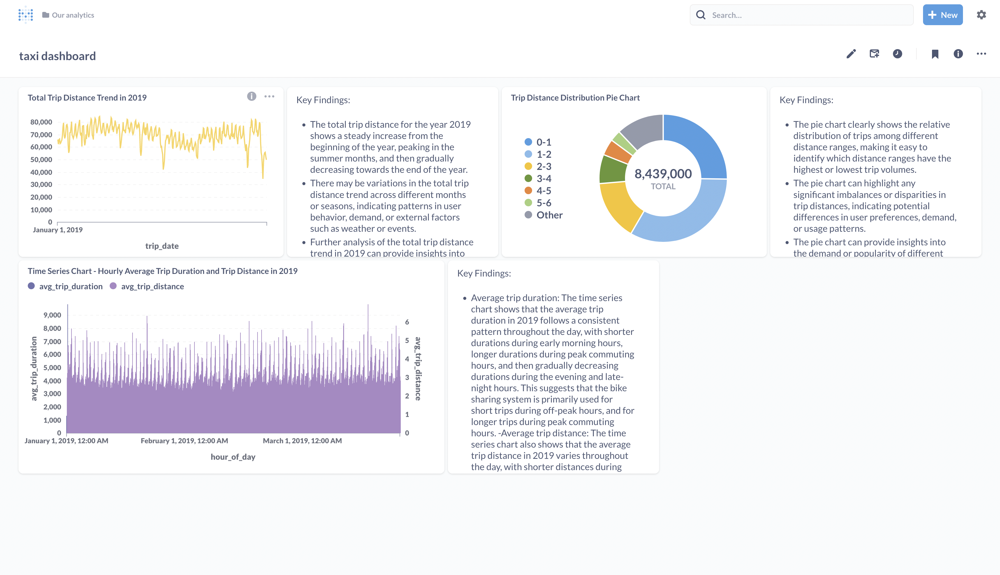

# NYC Neighborhood Transportation: Citi Bikes vs. Yellow Taxis

## Introduction

This repository contains the code and configurations for my data engineering project. The project aims to demonstrate the end-to-end data engineering pipeline for processing and visualizing data using AWS S3 and Metabase for data visualization and business intelligence (BI).

## Description

An Airflow DAG will periodically scrape these services, wrangle the data, and send the results into a Postgres database serving a tiny website, displaying which transportation method is fastest between two NYC neighborhoods. In addition, we have integrated Metabase, a powerful data visualization and business intelligence (BI) tool, to provide interactive and visually appealing dashboards for analyzing the scraped data. With Metabase, users can easily explore and gain insights from the transportation data, such as visualizing trends, comparing performance, and making data-driven decisions. This integration adds an enhanced layer of data visualization and BI capabilities to the project, making it a comprehensive solution for analyzing and visualizing the fastest transportation method between NYC neighborhoods.

The real data is only available in batches of months/years. Therefore we provide two APIs to mimic "live"
systems. The system can be brought online with the `docker-compose.yml` provided with this repository:

If all processing goes well, the final result is visible on http://localhost:8083.

Ports on which services are available:

- http://localhost:5432: Airflow Postgres DB (`airflow`/`airflow`)
- http://localhost:5433: NYC Taxi Postgres DB (`taxi`/`ridetlc`)
- http://localhost:5434: Citi Bike Postgres DB (`citi`/`cycling`)
- http://localhost:5435: NYC Transportation results Postgres DB (`nyc`/`tr4N5p0RT4TI0N`)
- http://localhost:8080: Airflow webserver (`airflow`/`airflow`)
- http://localhost:8081: NYC Taxi static file server
- http://localhost:8082: Citi Bike API (`citibike`/`cycling`)
- http://localhost:8083: NYC Transportation API
- http://localhost:3000: Metabase

## How to Run

In `dags/nyc_dag.py` change `BUCKET_NAME` to the name of your s3 bucket.

```bash
make build_all
docker-compose up -d
```



## Tools and Technology

This project utilizes the following tools and technologies:

- [Apache Airflow](https://airflow.apache.org/) - An open-source platform used to programmatically author, schedule, and monitor workflows.
- [Amazon S3](https://aws.amazon.com/s3/) - A cloud-based object storage service provided by Amazon Web Services (AWS) for storing and retrieving files.
- [Metabase](https://www.metabase.com/) - An open-source business intelligence (BI) and data visualization tool that allows you to easily analyze and visualize data from various sources.
- [Python](https://www.python.org/) - A popular programming language used for data engineering tasks and scripting.
- [Pandas](https://pandas.pydata.org/) - A powerful data manipulation library for Python that provides data structures like DataFrames for efficient data analysis and processing.
- [Docker](https://www.docker.com/) - A containerization platform that allows you to package an application and its dependencies into a single container for easy deployment and portability.
- [SQLAlchemy](https://www.sqlalchemy.org/) - A SQL toolkit and ORM (Object Relational Mapper) that provides a set of high-level API for connecting to databases and performing SQL operations.
- [PostgreSQL](https://www.postgresql.org/) - A powerful open-source relational database management system used for storing and retrieving structured data.
- [Citi Bike API](https://www.citibikenyc.com/system-data) - A public API provided by Citi Bike that allows you to access data related to Citi Bike rides.
- [NYC Yellow Taxi API](https://www1.nyc.gov/site/tlc/about/tlc-trip-record-data.page) - A public API provided by the New York City Taxi and Limousine Commission (TLC) that allows you to access data related to NYC Yellow Taxi rides.

## Credits

The code in this repository accompanies Chapter 14 of the book [Data Pipelines with Apache Airflow](https://www.manning.com/books/data-pipelines-with-apache-airflow).

The project idea and inspiration for this use case was based on the concepts presented in the blog post [Taxi vs Citi Bike NYC](https://toddwschneider.com/posts/taxi-vs-citi-bike-nyc) by Todd W. Schneider. The blog post explores the fastest mode of transportation between two NYC neighborhoods at given times and days using Citi Bikes and Yellow Taxis. We have leveraged these ideas to create a production-ready Airflow workflow in this project.

The code in this repository also includes two (mocked) real-time services created for this purpose:

1. A service providing Citi Bike rides
2. A service providing NYC Yellow Taxi rides


## Dashboard Display

### Citibike Dashboard


### Taxi Dashboard




## More information

### Taxi dataset

The taxi dataset refers to the "NYC Taxi and Limousine Commission (TLC) Trip Record Data", available here:
https://www1.nyc.gov/site/tlc/about/tlc-trip-record-data.page.

A snippet of the data:

```csv
VendorID,tpep_pickup_datetime,tpep_dropoff_datetime,passenger_count,trip_distance,RatecodeID,store_and_fwd_flag,PULocationID,DOLocationID,payment_type,fare_amount,extra,mta_tax,tip_amount,tolls_amount,improvement_surcharge,total_amount,congestion_surcharge
1,2019-01-01 00:46:40,2019-01-01 00:53:20,1,1.50,1,N,151,239,1,7,0.5,0.5,1.65,0,0.3,9.95,
1,2019-01-01 00:59:47,2019-01-01 01:18:59,1,2.60,1,N,239,246,1,14,0.5,0.5,1,0,0.3,16.3,
2,2018-12-21 13:48:30,2018-12-21 13:52:40,3,.00,1,N,236,236,1,4.5,0.5,0.5,0,0,0.3,5.8,
2,2018-11-28 15:52:25,2018-11-28 15:55:45,5,.00,1,N,193,193,2,3.5,0.5,0.5,0,0,0.3,7.55,
2,2018-11-28 15:56:57,2018-11-28 15:58:33,5,.00,2,N,193,193,2,52,0,0.5,0,0,0.3,55.55,
2,2018-11-28 16:25:49,2018-11-28 16:28:26,5,.00,1,N,193,193,2,3.5,0.5,0.5,0,5.76,0.3,13.31,
2,2018-11-28 16:29:37,2018-11-28 16:33:43,5,.00,2,N,193,193,2,52,0,0.5,0,0,0.3,55.55,
1,2019-01-01 00:21:28,2019-01-01 00:28:37,1,1.30,1,N,163,229,1,6.5,0.5,0.5,1.25,0,0.3,9.05,
1,2019-01-01 00:32:01,2019-01-01 00:45:39,1,3.70,1,N,229,7,1,13.5,0.5,0.5,3.7,0,0.3,18.5,
```

Data dictionary: https://www1.nyc.gov/assets/tlc/downloads/pdf/data_dictionary_trip_records_yellow.pdf

### Citi Bike dataset

https://www.citibikenyc.com/system-data

A snippet of the data:

```csv
"tripduration","starttime","stoptime","start station id","start station name","start station latitude","start station longitude","end station id","end station name","end station latitude","end station longitude","bikeid","usertype","birth year","gender"
201,"2019-01-01 03:09:09.7110","2019-01-01 03:12:30.8790",3183,"Exchange Place",40.7162469,-74.0334588,3214,"Essex Light Rail",40.7127742,-74.0364857,29612,"Subscriber",1993,1
505,"2019-01-01 05:18:00.1060","2019-01-01 05:26:25.9050",3183,"Exchange Place",40.7162469,-74.0334588,3638,"Washington St",40.7242941,-74.0354826,29213,"Subscriber",1972,2
756,"2019-01-01 10:36:33.3400","2019-01-01 10:49:10.2600",3183,"Exchange Place",40.7162469,-74.0334588,3192,"Liberty Light Rail",40.7112423,-74.0557013,26164,"Subscriber",1985,1
1575,"2019-01-01 12:43:38.6430","2019-01-01 13:09:54.5280",3183,"Exchange Place",40.7162469,-74.0334588,3638,"Washington St",40.7242941,-74.0354826,29672,"Customer",1969,0
1566,"2019-01-01 12:43:39.6010","2019-01-01 13:09:46.5100",3183,"Exchange Place",40.7162469,-74.0334588,3638,"Washington St",40.7242941,-74.0354826,29522,"Customer",1969,0
737,"2019-01-01 12:56:53.2040","2019-01-01 13:09:11.0400",3183,"Exchange Place",40.7162469,-74.0334588,3205,"JC Medical Center",40.71653978099194,-74.0496379137039,29447,"Subscriber",1993,1
917,"2019-01-01 13:03:44.7760","2019-01-01 13:19:02.7690",3183,"Exchange Place",40.7162469,-74.0334588,3277,"Communipaw & Berry Lane",40.71435836870427,-74.06661093235016,29299,"Subscriber",1986,1
3248,"2019-01-01 13:12:03.1280","2019-01-01 14:06:12.0400",3183,"Exchange Place",40.7162469,-74.0334588,3196,"Riverview Park",40.7443187,-74.0439909,29495,"Subscriber",1992,1
3168,"2019-01-01 13:13:12.0450","2019-01-01 14:06:00.4110",3183,"Exchange Place",40.7162469,-74.0334588,3196,"Riverview Park",40.7443187,-74.0439909,26312,"Customer",1969,0
```

## Potential Improvement Ideas

- Include CI/CD
- Add DBT
- Deploy AWS Infrastructure using Terraform 
